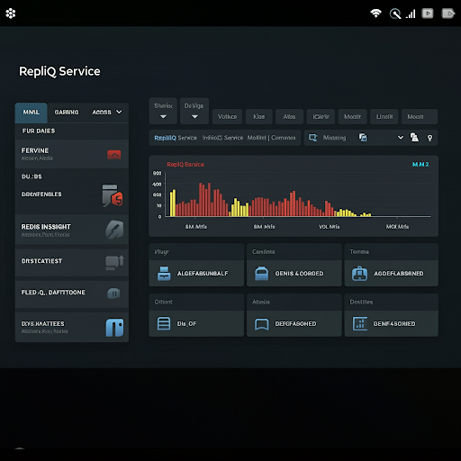

# repliq

Repliq (pronounced rep-li-kew) is an open-source, Kubernetes-native, high-performance, persistent, and replicated
message queue
written in Rust for deterministic, low-latency inter-process communication (IPC) and cross-machine replication. Inspired
by [Chronicle Queue](https://chronicle.software/queue/).


## Key Features

* **Memory-mapped files:**  Provides ultra-fast data access and efficient sharing between processes.
* **Asynchronous replication:** Enables scalable, cross-machine communication with low latency.
* **Familiar Rust queue interface:** Offers an intuitive API for easy integration.
* **Kubernetes-native:** Leverages Kubernetes features for seamless deployment and management.

## Coming Soon

**Target Release: Q1 2025**

Stay tuned for updates and the initial release.

## Preview of the API (Subject to Change)

```rust
use async_trait::async_trait;
use thiserror::Error;
use std::io;

#[derive(Error, Debug)]
pub enum QueueError {
    #[error("I/O error: {0}")]
    Io(#[from] io::Error),

    #[error("Replication error: {0}")]
    Replication(String),

    #[error("Queue is full")]
    Full,

    #[error("Queue is empty")]
    Empty,

    #[error("Invalid configuration: {0}")]
    InvalidConfig(String),

    #[error("Serialization error: {0}")]
    Serialization(String),

    #[error("Deserialization error: {0}")]
    Deserialization(String),

    #[error("Unexpected error: {0}")]
    Other(String),
}

// Trait representing a generic queue
#[async_trait]
pub trait Queue<T: Send + Sync> {
    async fn enqueue(&self, item: T) -> Result<(), QueueError>;
    async fn dequeue(&self) -> Result<Option<T>, QueueError>;
}

// Trait for a persistent queue (extends the basic Queue trait)
#[async_trait]
pub trait PersistentQueue<T: Send + Sync>: Queue<T> {
    // Create a new persistent queue, specifying the file path and capacity.
    fn new(path: &str, capacity: usize) -> Result<Self, QueueError>
    where
        Self: Sized;

    // Open an existing persistent queue from a file path.
    fn open(path: &str) -> Result<Self, QueueError>
    where
        Self: Sized;
}

// Trait for a replicated queue (extends PersistentQueue)
#[async_trait]
pub trait ReplicatedQueue<T: Send + Sync>: PersistentQueue<T> {
    // Configure replication settings, specifying the primary node, 
    // a list of secondary nodes, and the replication mode.
    fn with_replication(
        &mut self,
        primary_node: &str,
        secondary_nodes: Vec<&str>,
        replication_mode: ReplicationMode,
    ) -> Result<(), QueueError>;
}

// Enum for replication modes (synchronous or asynchronous).
pub enum ReplicationMode {
    Synchronous,
    Asynchronous,
}

// Implement a concrete ReplicatedQueue for ease of use
pub struct RepliqQueue<T: Send + Sync>(std::marker::PhantomData<T>);

#[async_trait]
impl<T: Send + Sync> Queue<T> for RepliqQueue<T> {
    async fn enqueue(&self, item: T) -> Result<(), QueueError> {
        // Implementation details...
        Ok(())
    }

    async fn dequeue(&self) -> Result<Option<T>, QueueError> {
        // Implementation details...
        Ok(None)
    }
}

impl<T: Send + Sync> PersistentQueue<T> for RepliqQueue<T> {
    fn new(path: &str, capacity: usize) -> Result<Self, QueueError> {
        // Implementation details...
        Ok(RepliqQueue(std::marker::PhantomData))
    }

    fn open(path: &str) -> Result<Self, QueueError> {
        // Implementation details...
        Ok(RepliqQueue(std::marker::PhantomData))
    }
}

impl<T: Send + Sync> ReplicatedQueue<T> for RepliqQueue<T> {
    fn with_replication(
        &mut self,
        primary_node: &str,
        secondary_nodes: Vec<&str>,
        replication_mode: ReplicationMode,
    ) -> Result<(), QueueError> {
        // Implementation details...
        Ok(())
    }
}
```

## Sample Usage

```rust
use repliq::{QueueError, ReplicatedQueue, ReplicationMode, RepliqQueue};

#[tokio::main]
async fn main() -> Result<(), Box<dyn std::error::Error>> {
    // Create a new replicated queue
    let mut queue = RepliqQueue::<String>::new("my_queue", 1024)?;

    // Configure replication
    queue.with_replication(
        "primary-node",
        vec!["secondary-node-1", "secondary-node-2"],
        ReplicationMode::Asynchronous,
    )?;

    // Enqueue an item
    queue.enqueue("Hello, repliq!".to_string()).await?;

    // Dequeue an item
    match queue.dequeue().await? {
        Some(message) => println!("Dequeued item: {}", message),
        None => println!("Queue is empty!"),
    }

    // Demonstrate error handling
    if let Err(e) = queue.enqueue("This might fail".to_string()).await {
        match e {
            QueueError::Full => eprintln!("Failed to enqueue: Queue is full"),
            QueueError::Io(io_error) => eprintln!("I/O error during enqueue: {}", io_error),
            QueueError::Replication(msg) => eprintln!("Replication error during enqueue: {}", msg),
            _ => eprintln!("Unexpected error during enqueue: {:?}", e),
        }
    }

    Ok(())
}
```

## Kubernetes and Docker Hub Usage (Proposed)

`repliq` is designed to be Kubernetes-native. You'll be able to deploy it as a Docker container within your Kubernetes
cluster and configure it using Kubernetes resources like ConfigMaps and Secrets.

**Example Deployment (Conceptual):**

```yaml
apiVersion: apps/v1
kind: DaemonSet
metadata:
  name: repliq-daemon
spec:
  selector:
    matchLabels:
      name: repliq
  template:
    metadata:
      labels:
        name: repliq
    spec:
      containers:
        - name: repliq
          image: mahurangisoftware/repliq:latest
          resources:
            limits:
              memory: 200Mi
            requests:
              cpu: 100m
              memory: 200Mi
          volumeMounts:
            - name: repliq-storage
              mountPath: /var/lib/repliq
          ports:
            - containerPort: 31337
          env:
            - name: NODE_NAME
              valueFrom:
                fieldRef:
                  fieldPath: spec.nodeName
            - name: REPLIQ_CONFIG
              valueFrom:
                configMapKeyRef:
                  name: repliq-config
                  key: config.yaml
      volumes:
        - name: repliq-storage
          hostPath:
            path: /var/lib/repliq
            type: DirectoryOrCreate

---

apiVersion: v1
kind: ConfigMap
metadata:
  name: repliq-config
data:
  config.yaml: |
    replication:
      mode: async
      discovery:
        method: kubernetes
        label_selector: name=repliq
    queue:
      capacity: 1000000
      persistence:
        path: /var/lib/repliq/data

---

apiVersion: v1
kind: Service
metadata:
  name: repliq-service
spec:
  selector:
    name: repliq
  ports:
    - protocol: TCP
      port: 31337
      targetPort: 31337
  type: ClusterIP
```

## Dashboard



## Integrations

Repliq seamlessly integrates with various tools and platforms to enhance monitoring, scaling, and overall operational
efficiency:

* **Prometheus**: Export key metrics for comprehensive monitoring and alerting.
* **Grafana/Telegraf**: Visualize Repliq performance data with customizable dashboards.
* **More to follow...**

For detailed integration guides, please refer to our [documentation](https://docs.repliq.io/integrations).

## Benchmarks

...

## License

This project is licensed under the [GNU General Public License](LICENSE).
